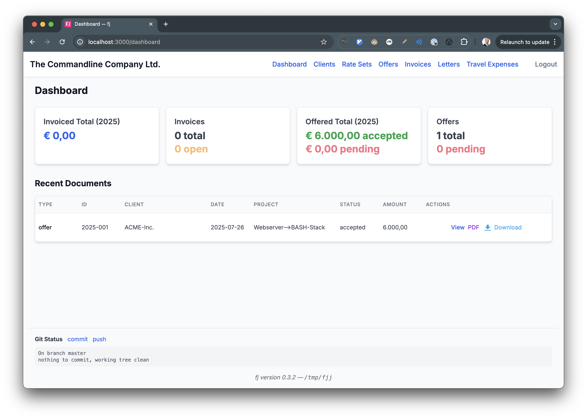

#  fj — The Commandline Company

```shell
$ fj -h
 Usage: fj [command] [options]

 Commands:
  init            Initialize fj
  git             Configure git remotes, push, pull, status
  client          Manage clients
  rate            Manage rates
  letter          Manager letters
  offer           Manager offers
  invoice         Manage invoices
  serve           Start the HTTP server for a web UI

 General Options:
  -h, --help      Displays this help message then exits

  -C, --fj_home   The FJ_HOME dir to use
                  Default: $FJ_HOME orelse ~/.fj
```

`fj` is what I use to create offers, invoices, and the occasional letter for my
own company. It helps manage business documents using LaTeX and Git in a
structured, auditable way.

**About the name:** `fj` is designed for speed and comfort — just your index
fingers on the homerow! And if you look closely, the j almost looks like an i in
many fonts, a playful nod to “finance.”

The default LaTeX templates are laid out according to conventions common in the
German-speaking world.

`fj` sets up a Git-managed directory structure (“fj home”) and guides you through
each step of the document lifecycle. You define your company details — including
name, address, bank info, contact email, and logo — once in a JSON config file.
Clients and rate sets are added through their own editable JSON records.

When you create a new document, `fj` generates a self-contained working
directory containing the LaTeX template, your logo, and metadata placeholders. A
JSON file is also created and pre-filled with client information and other
defaults. You edit that file to customize document-specific fields — such as the
project name, applicable rates, VAT settings, or footer options. For offers and
invoices, you also fill in a `billables.csv` with the actual billable items.

Once the details are in place, you use `fj compile` to render the PDF. When
you’re satisfied, `fj commit` assigns a permanent ID, re-renders the PDF, and
commits the entire directory to the Git-managed archive.

---

## Features

- Company-wide configuration of name, address, bank info, and logo
- Structured client and rate set definitions
- Generates working directories with LaTeX files, logo, and metadata
- CSV-based input for billables (invoices/offers)
- Manual editing and iterative compilation
- Reliable ID assignment with file locking
- Git-managed document archive ("fj home")
- Web UI mode (`fj serve`)
- Travel Expenses tool (web only): upload receipts, enter details -> download a
  zip with all receipts converted to PDF, and a travel log PDF.

---

## Getting Started

### 1. Initialize your company setup

```sh
fj init --generate=true config.json
# edit config.json to set company details
fj init config.json

# (optional) configure a remote to sync your document archive
fj git remote add --repo=online --url=user@server.com:fj_archive.git

# (optional) start the web server and continue working in the browser
fj serve [--username=] [--password=] [--host=] [--port=]
```

---

### 2. Add a client and rate set

```sh
fj client new acme
# edit acme.json with client address and contact info
fj client commit acme

fj rate new standard
# edit standard.json with named entries and amounts
fj rate commit standard
```

---

### 3. Create and finalize a document

```sh
fj invoice new acme --rates=standard
cd invoice--2025-XXX--acme/

# edit billables.csv and invoice.json
fj invoice compile
#          ^^^ repeat editing and compiling until satisfied

fj invoice commit

# (optional) push the updated archive to your remote
fj git push    # [--repo=online]
```

- `compile` generates a PDF using LaTeX (run twice for references)
- `commit` assigns an ID, recompiles, and archives the result to `fj home`, then commits it to Git

---

## Document Types

| Type     | Inputs                            | Uses CSV? | Notes                      |
|----------|-----------------------------------|-----------|----------------------------|
| Offer    | JSON metadata, billables.csv      | Yes       | Project title, rates etc.  |
| Invoice  | JSON metadata, billables.csv      | Yes       | Totals, VAT, etc.          |
| Letter   | JSON metadata, direct LaTeX edit  | No        | Freeform content           |

Each type generates a directory like `offer--2025-XXX--clientname/`. Temporary IDs (`XXX`) become permanent on commit.

---

## fj serve

For extra convenience, you can run all of the above, and more, in a local webserver via the `fj serve` command:



The dashboard, obviously, is unique to the web view.

As an extra `fj serve` bonus, the web interface also provides a travel expense form where you can describe your journey in a structured way and upload receipts. It will generate a summary PDF describing the journey and the receipts, convert all receipts to PDF, and name all generated files with a common prefix unique to the journey. After that, it lets you download a zip archive of all generated files. I use this feature to generate grouped travel expense documents, ready for upload to my tax advisor's server.

One day, if time permits, I'll also add a CLI command for this feature, to stay true to the commandline ethos 🤠.

---

## Philosophy

`fj` is minimal and transparent. It helps generate documents with consistent
structure and layout, but leaves all meaningful content — text, metadata, layout
— under your direct control.

Everything is local, version-controlled, and reproducible. You can sync your
archive using `fj git push`, or host it behind SSH on a hardened server. Since
everything is file-based, `fj` works just as well remotely or in air-gapped
environments.

---

## License

[MIT](./LICENSE)
